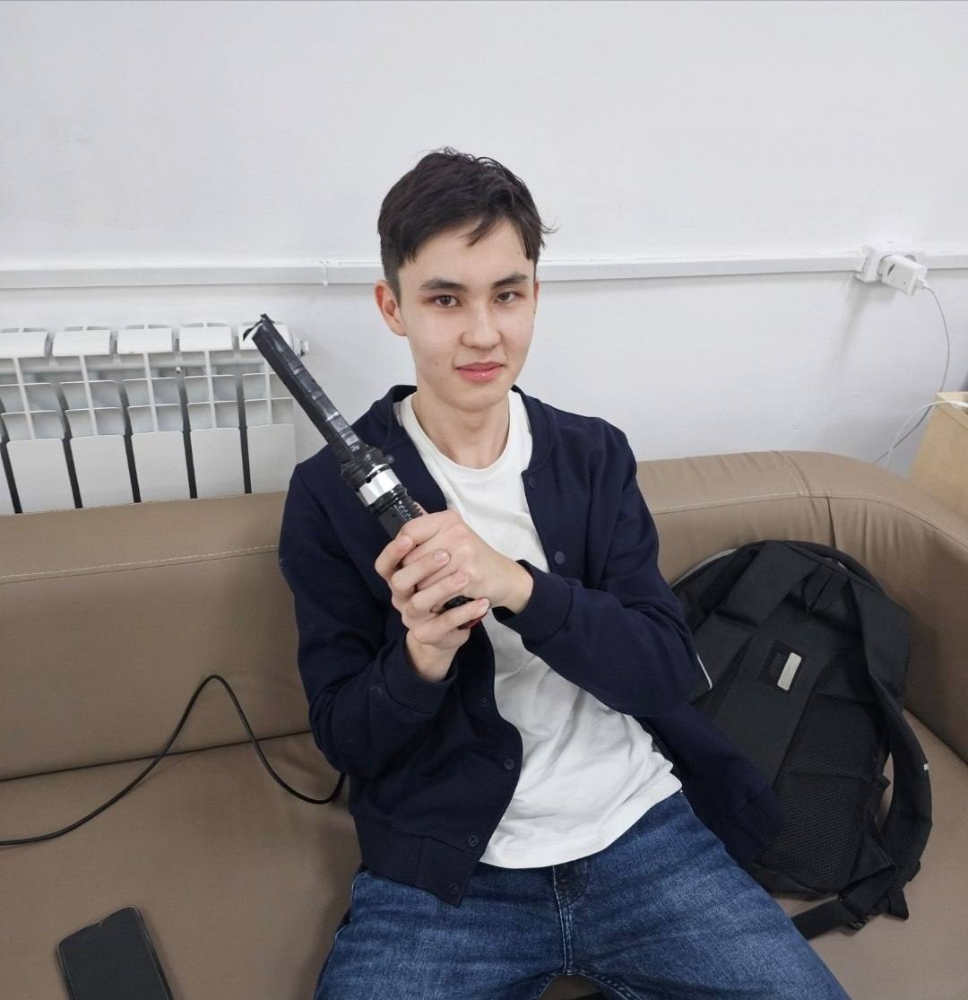
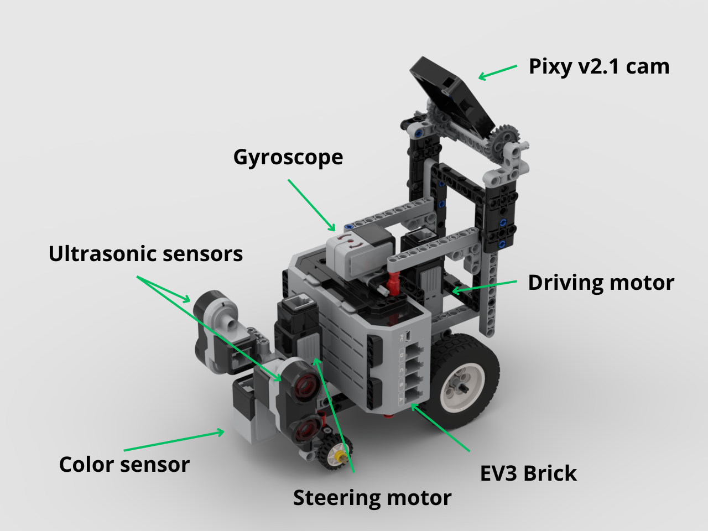
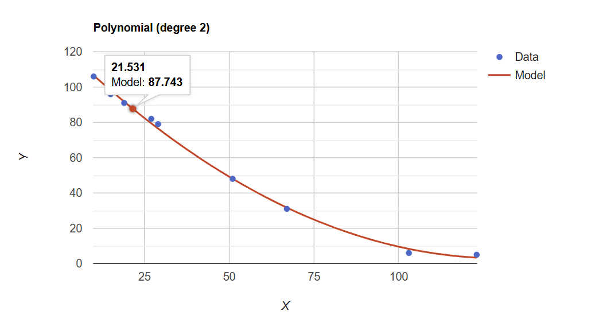
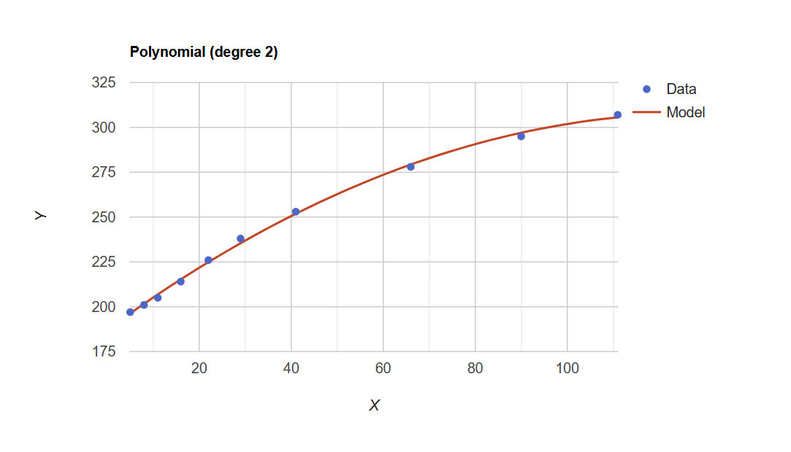
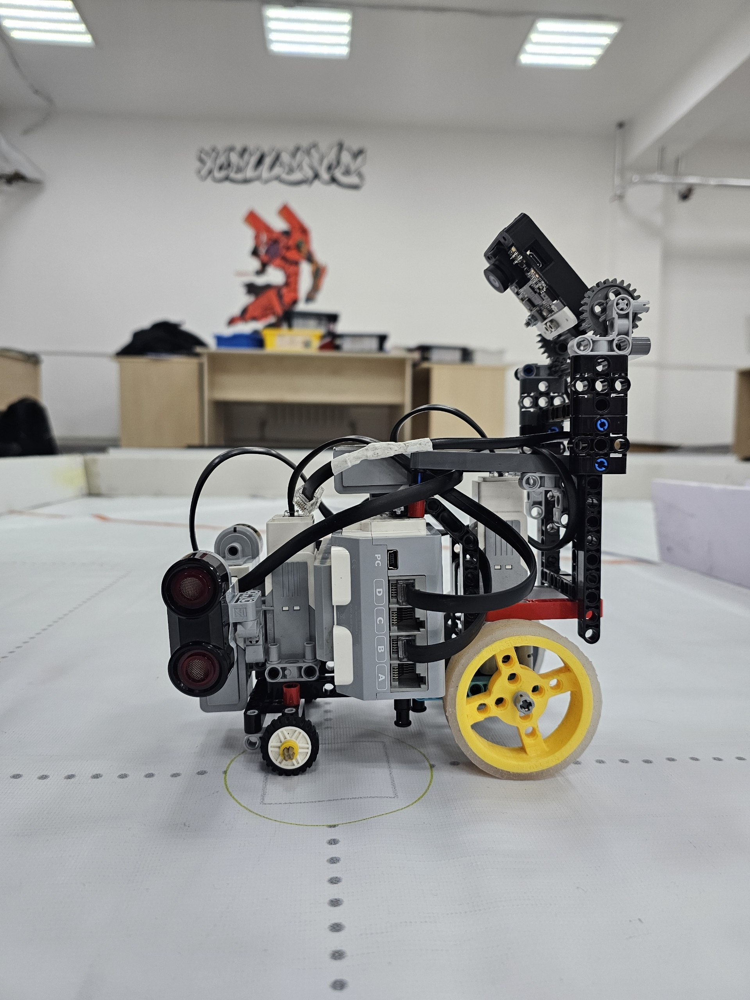
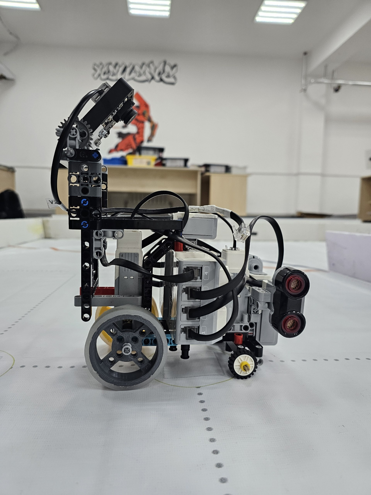
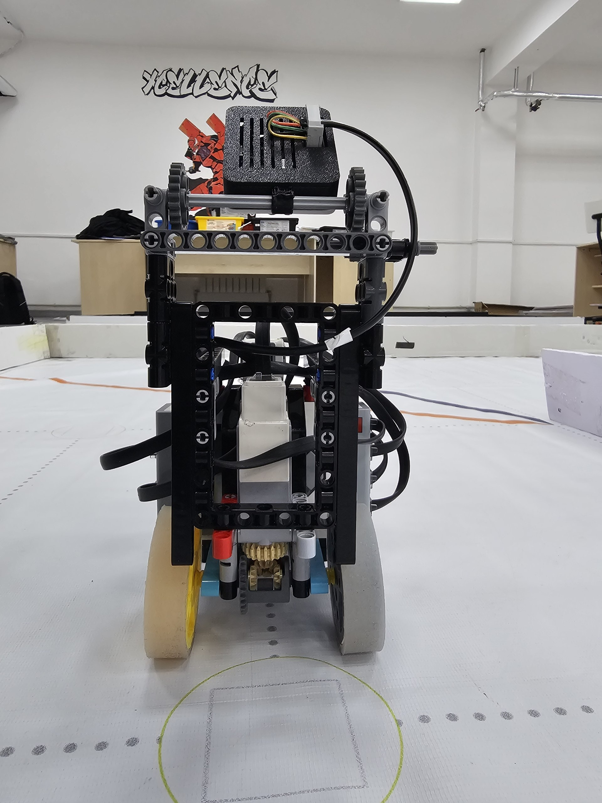
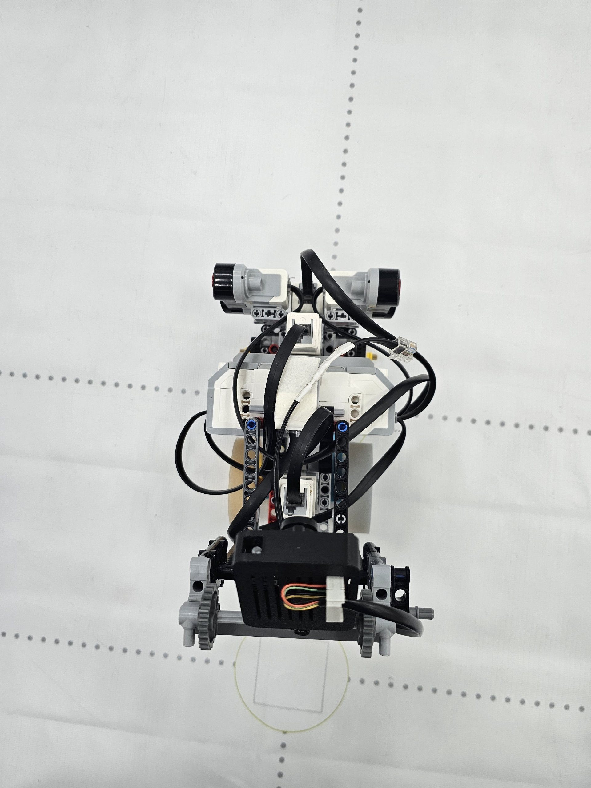

# 

 Welcome to the GitHub Repository of Team XLNC Apex from Kazakhstan, competing in the World Robot Olympiad Future Engineers 2026 category.

# Contents
- [The team](#the-team)
- [Challenge Overview](#challenge-overview)
- [Our Robot](#our-robot)
- [Mechanical systems](#mechanical-systems)
- [Electronic systems](#electronic-systems)
- [Software](#software)
- [Robot photos](#robot-photos)

## Directories structure
WRO_FE_2026_REGIONAL
├── code            # Our python code(uv project)
│   └── src         # Main code(open.py, obstacle.py)
│       └── tests   # Some code to test little things
├── images          # Images(for docs)
├── models          # Lego model, Pixy2 cam case
├── research        # Researches: obstacle, programming
├── t-photos        # Team photos
├── v-photos        # Vehicle Photos
└── README.md       # Main docs file

# The team

### Members

| Karabayev Darkhan | Abenov Sayan |
| --- | --- |
|  |  |

# Challenge Overview

The **WRO Future Engineers** category requires building a **fully autonomous self-driving vehicle** that:

- Navigates a closed track without external control  
- Detects and avoids obstacles dynamically  
- Maintains stability and precision at speed  
- Adapts to uncertain and changing conditions  

Key engineering challenges:
- Real-time perception  
- Reducing sensor errors  
- Keeping right distance from walls  
- Reliability under competition constraints  

# System Architecture

Our robot is designed as a modular system consisting of three tightly integrated layers:

### 1. Perception Layer
- Vision-based detection using **Pixy2 camera**
- Object tracking and color signature recognition  
- Distance estimation using onboard sensors  

### 2. Control Layer
- Closed-loop control using **PID algorithms**  
- Steering and speed regulation  
- Real-time decision-making  

### 3. Execution Layer
- Motor actuation via LEGO EV3 platform  
- Precise movement and trajectory correction  

This layered approach allows us to isolate complexity and improve reliability.

# Our Robot

Our robot is a compact autonomous vehicle optimized for **speed, stability, and deterministic behavior**.

### Key Design Principles
- **Consistency over complexity**  
- **Low-latency decision making**  
- **Mechanical reliability first**  

### Capabilities
- Obstacle detection and avoidance  
- Smooth cornering with PID stabilization  
- Real-time trajectory correction  

# Mechanical Systems

The mechanical design is focused on achieving predictable and stable motion.

### Features
- Rigid and lightweight chassis  
- Optimized center of mass for high-speed turns  
- High-precision steering mechanism  
- Efficient drivetrain using LEGO components  

### Engineering Decisions
- Minimized mechanical play for better control accuracy  
- Balanced gear ratios for torque vs speed trade-off  
- Structural reinforcement for competition durability 

### Steering

### Geometry
We thought to use Ackerman's steering for more efficient turns. 
However, firstly we built this parallel steering.

Quickly noticed the issue and fixed it:

It works great, and since it meets our criteria, no Ackerman geometry is required.

| It is controlled by the medium ev3 motor. This motor has accurate encoder and after calibration at program start, it acts basically like a servo.|  |
| --- | --- |

### Rear-Wheel Drive(RWD)

We use differiential to properly drive while turning. It eliminates required otherwise wheels slippage, due to the fact that wheels travel arcs with different radii, thus, should rotate at different rates.

It is powered by medium EV3 motor.

### Gyroscope

LEGO EV3 gyroscope is used to know robot orientation.

Problem: These gyroscopes drift frequently.

Reason: During gyroscope power on, it captures initial angular velocity. Also the error accumulates with time.

Solution: Power cycle the gyroscope. Pybricks added .calibrate() method to reboot ev3 gyro.

# Electronic Systems

Our robot is powered by the **LEGO EV3** platform with extended sensing capabilities.

### Core Components
- **LEGO EV3 Brick** — main controller  
- **Pixy2 Camera** — primary vision sensor  
- Motors with encoder feedback  
- Auxiliary sensors (distance, color, etc.)  

### Design Focus
- Reliable communication between modules  
- Low-latency sensor data processing  
- Stable power distribution  

When we started to prepare for WRO we had to choose the platform we are going to use.

We had a choice of completely custom platform or EV3 we already have.

Custom board requires us to choose components and order them, which can take up to a month of waiting. We have to design and 3d print parts.
Accounting for that, there probably at least a month to just assemble a first version of a robot. We wanted to start fast to spend more time programming.

The EV3 was the fastest to get started with.
EV3 robot assembly took approximately 1 day.(Later we added camera while programming).

[Assembly instructions for our robot are available.](xlnc_apex_instruction.pdf)

# Pixy 2.1 camera:

We had a part of the case, but not the front lid. That was an opportunity to learn FreeCAD and 3d printing! [Link to CAD](3d_models/pixy_holder/small_holder3.FCStd)

Camera is fixed on an axle and the viewing angle can be set using gears.

We set the optimal angle to fit as much field on screen and less noisy world

# Software

The software stack is built using **Pybricks (MicroPython)** and follows a modular architecture.

### Core Modules
- **Steering Module**  
  - PD controller for gyroscope's angle
  - Tracking right steering angle 

- **Wall Avoidance Module**  
  - Finding the perpendicular to the outer wall
  - Proportional controller for distance from outer wall

- **Line Detection Module**  
  - Obstacle avoidance strategy  
  - State-based behavior system  

- **Obstacle Detection Module**  
  - Filtering unnecessary objects
  - The most optimal trajectory

### Coding platform:

After careful selection and [research](research/programming_environment_choice.md), for EV3, we chose an [experimental version of Pybricks](https://github.com/pybricks/pybricks-micropython/tree/master/bricks/ev3) with **significantly faster execution time** due to bare metal firmware and without the use of an SD card.

### Open challenge:

For the open challenge, we chose a simple strategy of driving along the outer wall using a gyroscope and ultrasonic sensor. Turn and direction detection occur using a color sensor.

Firstly, the robot starts gyro calibration and angle resets. We reset the steering motor by running it until stalled to the left, to the right, and to the half. Then, a while loop starts until all 12 lines are passed. The car drives forward to the first line. The color sensor recognizes the color, whether it's orange or blue, and based on this, we can determine the direction (orange for clockwise and blue for counter-clockwise) and the right ultrasonic. Since the robot is driving along the outer wall, moving the internal walls won't bother the robot. The running loop operates at a > 50 Hz frequency; it's not much, but it's enough to successfully complete the task. We use a PD controller for the gyroscope and a proportional controller for wall detection. By reading the distance from the ultrasonic, we take into account the robot's rotation angle and find the perpendicular to the wall. To avoid reacting to the line twice per turn, we have a distance timeout, which is calculated using the rotation angle of the rear motor. Once the passed_lines variable is equal to 12 (which means all 3 laps are finished) the robot drives forward for a set period of time to land in its starting area and stops.

### Obstacle challenge:

The Obstacle Challenge is similar to the Open Challenge, with the exception of a Pixy2 camera correction as well as parking out.

#### Parking out
Robot is placed close to the farthest from moving direction parking wall. Then, the car determines the moving direction by the distance from side ultrasonic. 
The steering wheels rotate fully, car drives while turning, for approximately 800ms.

When the camera detects an obstacle, gyroscope and ultrasonic correction are disabled, and the robot follows the most optimal trajectory, which we've determined using point-based regression. As a result, the obstacle moves on the camera along an optimal nonlinear trajectory.

| **Green obstacle** | **Red obstacle** |
| --- | --- |
|  |  |

# Robot photos

|  |  |  |
| --- | --- | --- |
|  |  |  |